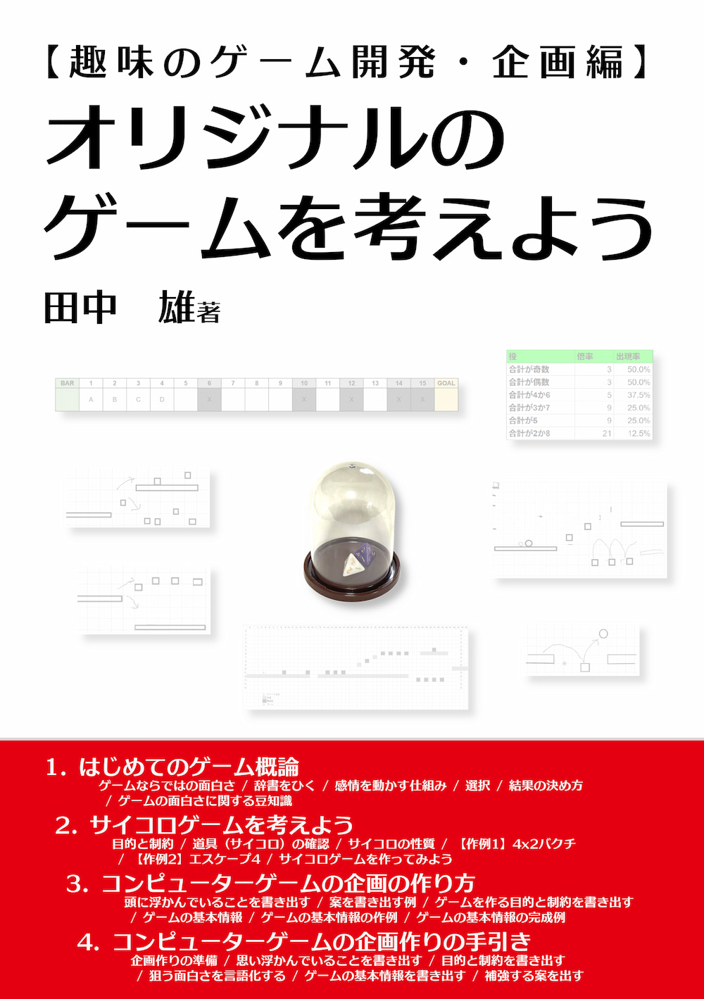

[技術書典18](https://techbookfest.org/event/tbf18/market)(2025/5/31-6/15)新刊!!

[技術書典オンラインマーケットページ](https://techbookfest.org/product/2FY5JrstKxtB7xj9DJrXjc)

## 正誤表

現在、ありません。

## 報告先

書籍について、誤りや問題点がございましたら、[こちら](https://github.com/am1tanaka/HobbyGameDevDesignBook/issues)のIssuesからお知らせいただければ幸いです。

## 本書に掲載した作例

[本書](https://techbookfest.org/product/2FY5JrstKxtB7xj9DJrXjc)に掲載している作例の倍率やゲームシート、企画構想書へのリンクです。書籍に、これらのゲームを遊ぶ例や、考え方を掲載しています。

### 【サイコロゲーム作例1】4x2バクチ

[4x2バクチ ゲームシート](https://docs.google.com/spreadsheets/d/1J-8BaxM6R72p_8pbDuFKmz6afNpkczGaNkDVO4wQ96U/)

Googleスプレッドシートです。ご自身のGoogleアカウントにコピーすると、シートに書き込んで、ゲームを遊べます。

### 【サイコロゲーム作例2】エスケープ4

[エスケープ4 ゲームボード](https://docs.google.com/spreadsheets/d/18By8u05BYQKfGW1ao2sIp_MjaJX3c5QGNTZutj0FgGA/)

Googleスプレッドシートです。ご自身のGoogleアカウントにコピーすると、シートに書き込んで、ゲームを遊べます。

[エスケープ4 ゲームボードPDF](./images/escape4_board_a5.pdf)

ゲームボード画像のPDFファイルです。A4の紙に、A5サイズで印刷されます。

### ジャンプ＆ポン

[ジャンプ＆ポン企画概要書](https://docs.google.com/document/d/1094vOcSmarVTz6oveydEAVjaPNaae-sdmGNZ643abgQ/)

ジャンプ＆ポンの基本情報をまとめたGoogleドキュメントです。

## おまけ作例

書籍に掲載を見送ったものと、過去の作例です。

### 【サイコロゲーム作例3】出目決戦ゲームシート

[出目決戦ゲームシート](https://docs.google.com/spreadsheets/d/1Am10rdbJ0xRXDCdmnwnHG-JHRruNVgSk4LP-F0Nh5cU/)

最初に作った作例ですが、ルールや遊び方がややこしく、本からは割愛しました。せっかく作ったのと、出目の大小で結果を決める例でもあるので、ここで公開します。

### VoxelorerBirdひよこ編・企画構想書

[VoxelorerBirdひよこ編・企画構想書](https://docs.google.com/document/d/1n1Oxek9KgKN5j5TC0U0y48OSzzlLONp_oDUDpGcu20s/)

以前に出版したパズルゲームのブロックの解説本に掲載したゲームの企画概要書です。

[GitHub. VBirdHiyoko. 公開リポジトリー](https://github.com/am1tanaka/VBirdHiyoko)

パズルゲーム『VoxelorerBirdひよこ編』の公開リポジトリーです。

[レベルアップゲームプログラミング・パズルゲーム開発で初心者から中級者へ！](https://nextpublishing.jp/book/17752.html)

VoxelorerBirdひよこ編のブロックの開発についての解説本の商業版です。

---

(C) 2025 田中　雄
